# Spotify-Data-Pipeline-AWS
Python, AWS (S3, Lambda, Glue, and Athena), and PowerShell 
## Overview
On this project, we expect to Extract, Transform, and Analyze data with AWS Services and Spotify's API. Using Python/Lambda, we take Spotify's API and extract raw data into S3 buckets. In another Lambda function, we transform that data into an organized manner that allows AWS Glue to read each category and separate them into different Schemas. Lastly, we use Athena to create a database that allows us to query/sort the data
# Instructions
## 1. S3 Buckets
First, you want to create S3 Buckets within Amazon Web Services. Let's start with the names. Create two buckets named "spotify-raw-(yourname)" and "spotify-transformed-(yourname). After this is completed, in each bucket, create folders in each respective bucket named "to_processed" in the raw bucket and "transformed" in the transform bucket. 
#### It should look like this 

    
## 2. Lambda/Python
First you need create a ZIP file so you can upload it to Lambda. You will use PowerShell to complete this.  
#### 1. Open PowerShell and copy these lines in
Remove-Item -Recurse -Force package -ErrorAction SilentlyContinue 
##### Makes a folder named "Package"
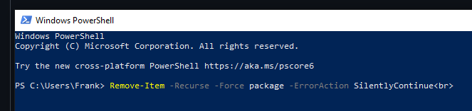 
#### 2.
py -m pip install -t package spotipy requests 
##### Installs dependencies to the "Package"
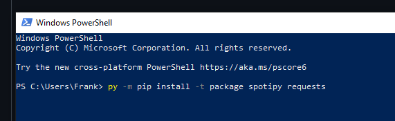 
#### 3.
Copy-Item spotify_api_data_extract.py package\ 
##### Moves <a href="https://github.com/Grifynn/Spotify-Data-Pipeline-AWS/blob/main/spotify_api_data_extract.py" > spotify_api_data_extract.py</a> into the "Package"
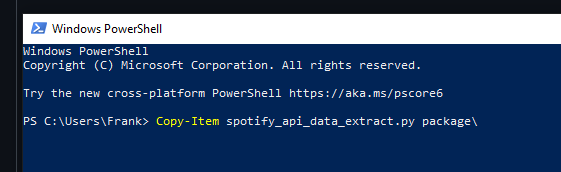 
#### 4. 
Compress-Archive -Path package\* -DestinationPath extractor.zip -Force 
##### Extracts all the files in "Package" and turns them into a ZIP
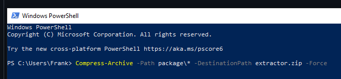   
## Repeat the process for the transform file 
#### 1. Reopen PowerShell and copy these in (Makes a folder named "Package2")
Remove-Item -Recurse -Force package2 -ErrorAction SilentlyContinue 
#### 2. Installs dependencies to the "Package2"
py -m pip install -t package2 spotipy requests 
#### 3. Moves <a href="https://github.com/Grifynn/Spotify-Data-Pipeline-AWS/blob/main/spotify_transform_load_function.py" > spotify_transform_load_function.py</a> into "Package2"
Copy-Item spotify_transform_load_function.py package\ 
#### 4. Extracts all the files in "Package" and turns them into a ZIP
Compress-Archive -Path package2\* -DestinationPath transform.zip -Force   
## Lambda/Python Pt. 2
In this step, head over to the Lambda Console and create two Lambda Functions named "spotify-extractor" and "spotify_transformer".
#### Function names

Once this is complete, let's go into the spotify_extractor function. Upload your new "extractor.zip" into the code source    
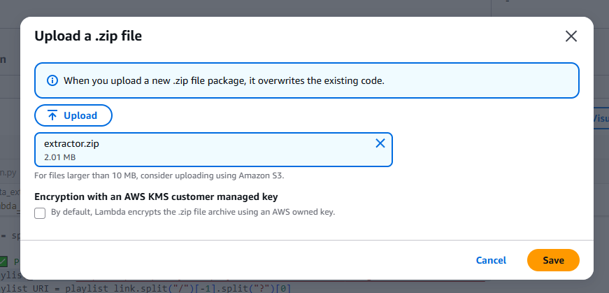
Scroll down to "Runtime settings" and change the "Handler" to spotify_api_data_extract.lambda_handler. ( Exact name of py file before .lambda_handler)
#### Handler
   
Then you want to set the Environment Variables. You have 3 you want to input: 
#### S3_BUCKET_RAW = (Your Raw S3 Bucket) eg. spotify-raw-frank   
##### I'LL SHOW YOU HOW TO OBTAINS THESE BELOW! 
#### SPOTIFY_CLIENT_ID:------  
#### SPOTIFY_CLIENT_SECRET:------  
#### Environment Variables (Bottom Left)
  
#### Obtain Spotify Keys
Head over to https://developer.spotify.com/ and sign in with your regular Spotify account. Head over to the dashboard and find your keys.    
 
 
Once you have obtained them, input them into your Environmental Keys (SPOTIFY_CLIENT_ID: SPOTIFY_CLIENT_SECRET:).    
When your variables are set. Go to line 22 in the code and change playlist_link to whatever playlist you would like to see (Make sure you deploy to save your changes) 
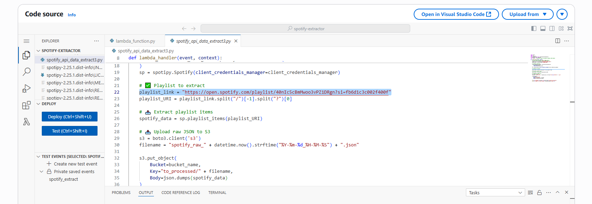  
  
Now repeat this exact process for <a href="https://github.com/Grifynn/Spotify-Data-Pipeline-AWS/blob/main/spotify_api_data_extract.py](https://github.com/On-car/spotify-end-to-end-data-engineering--project/blob/main/spotify_transformation_load_function.py)" >spotify_transformation_load_function.py</a>. The only thing you need to do differently is create a new Environment Variable for "S3_BUCKET_TRANSFORM"  
### 3. Glue Crawler
Head over to the Glue Console. On the left-hand side, Find Data Catalog -> Databases. In here, clicked "Add Database" and name it spotify_db   
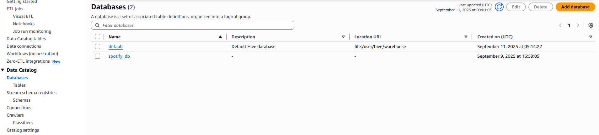  
Once your database is named, now create a table and follow the instructions.    
##### 1. Add Table
##### 2. Name - Set the folder name to "transform"
##### 3. Database - Select the Database you just created
##### 4. Datastore - Select S3 and for Include path: Browse to your S3 Transform folder  
  
##### 5. Data Format - Select JSON
##### 6. Review & Create - Click Create Button  
### Glue Crawler
Follow these steps to create a Glue Crawler
##### 1. Go to Data Catalog -> Crawlers -> Create Crawler
##### 2. Name your Crawler spotify_crawler
##### 3. Add a data source -> S3 Path: Put your S3 Transform folder
   
##### 4. Subsequent Crawler Runs: Crawl all-subfolders -> Add an S3 Data Source
##### 5. Follow steps below on 5. IAM Permissions: Create new IAM Role -> AWSGlueSerivceRole-S3Access -> View -> Add AmazonS3FullAccess
##### 6. Choose a Database -> spotify_db
##### 7. Review and Create 
 

### 4. IAM Permissions

Now, to tie everything together, you need to allocate permissions to each AWS Function 
 
#### Starting With Lambda
 
Go over to your spotify_extrator function and head into the configurations tab. In there go to permissions and you'll find "Role Name" under Execution Role. Click on the link. You'll be transferred over to the IAM page, where you need to create a user. Once you have done that, go to back to the role name and click it again.    

  

Click on the "Add Permissions" --> Attach Policies. Search up "AmazonS3FullAccess" and click add "Add permissions"    

##### Now it should look like this:
   
Now repeat the exact process for your other Lambda Function    

### 5. Obtain Data

##### 1. Go to Lambda -> spotify_extractor -> Code -> Test 
##### Test is in the middle left  
 
##### 2. Go to spotify_transform -> Code -> Test
##### 3. Go to Glue -> Data Catalog -> Crawlers -> Select spotify_crawler -> Run (Top Right) and Wait
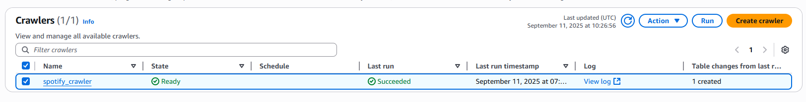 
##### 4. Once done: Data Catalog -> Databases -> spotify_db -> transformed to the right hit Table Data (Bottom)
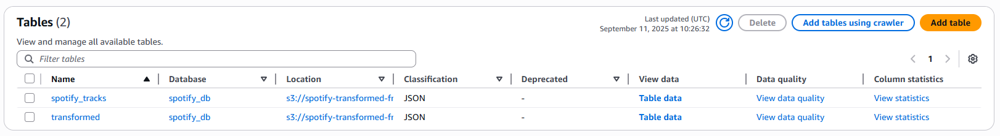 
##### 5. You should get redirected to Athena: Run this query:  
CREATE EXTERNAL TABLE IF NOT EXISTS spotify_db.spotify_tracks (
  `track_id` string, 
  `track_name` string, 
  `artist` string, 
  `album` string, 
  `release_date` string, 
  `added_at` string, 
  `popularity` string 
) 
ROW FORMAT SERDE 'org.openx.data.jsonserde.JsonSerDe' 
WITH SERDEPROPERTIES ('ignore.malformed.json' = 'true') 
LOCATION 's3://spotify-transformed-frank/transformed/' 
TBLPROPERTIES ('classification' = 'json'); 
 
#### Format to look like this and "Run"  
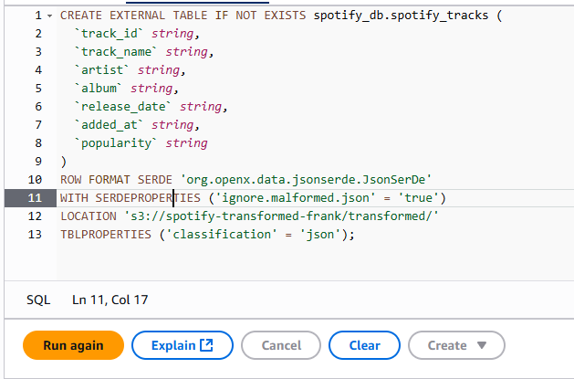
 

##### 6. Now, in a different query window, you can run something like this and play around with the SQL  
SELECT artist, track_name, album, popularity FROM "AwsDataCatalog"."spotify_db"."spotify_tracks" limit 30;
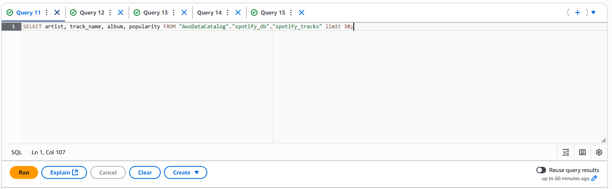

### Conclusion
Now you have a fully functional pipeline of data from API -> S3 Bucket -> Glue -> Athena. This is a relatively simple project you can do to pick up AWS services. This platform allows you to do amazing things, including automation from the first Lambda Function to the input into the Glue Database. All of these Services can be monitored by CloudWatch, where you can see the logs of each service. Here, you can break down certain things that go wrong and troubleshoot each log.

